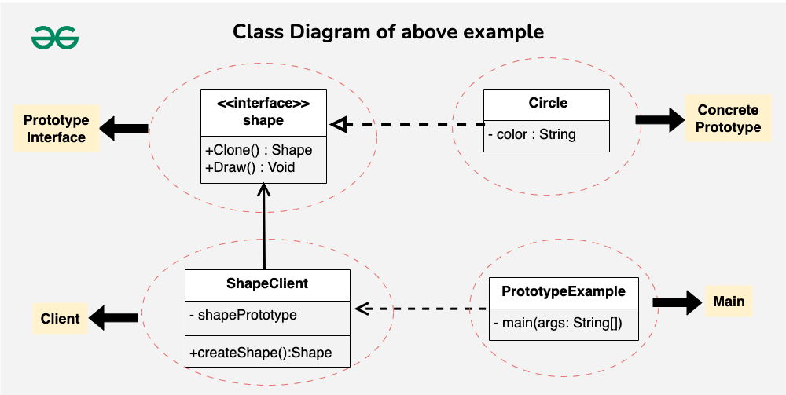

# Laboratorio 3: Patrón de diseño Prototype

**Estudiante:** Katherine Acosta Barquero

## Patrón Prototype aplicado al proyecto de Recetas

**Estudiante:**

## Definición del patrón

El patrón **Prototype** es un patrón de diseño **creacional** que permite crear nuevos objetos mediante la **clonación de una instancia prototipo**, en lugar de construir objetos desde cero. Esto evita repetir procesos complejos y facilita crear variaciones basadas en una estructura común.

En resumen: se crea un objeto base (prototipo) y a partir de él se generan copias que luego se personalizan.

---

## Problema

Muchos sistemas necesitan crear objetos complejos que comparten la estructura interna, cuando no existe una interfaz que permita reutilizar este proceso, aparecen problemas como:

- Duplicación de código al construir objetos casi idénticos
- Costos de creación elevados cuando el objeto requiere múltiples pasos o configuraciones
- Riesgo de inconsistencias porque cada componente que crea esos objetos implementa su propia lógica

## Solución

En lugar de crear una instancia desde cero, se clona el prototipo y se modifican solo las partes variables del nuevo objeto. Esto elimina la duplicación de la lógica y permite crear objetos más eficiente y consistentes.

---

## Analogía

El patrón Prototype puede entenderse como un apartamento modelo en un proyecto inmobiliario: en lugar de diseñar cada apartamento desde cero, la constructora parte de un modelo base ya definido y lo copia para crear nuevas unidades. Cada copia conserva la misma estructura, pero puede personalizarse según el cliente sin modificar el original. Esto permite crear muchas variantes rápidamente, con consistencia y sin repetir el trabajo inicial, tal como hace Prototype al clonar un objeto base para generar nuevas instancias modificables.

---

## Estructura general del patrón

---

## ¿Cómo mejora el mantenimiento o escalabilidad del sistema?

- **Centraliza:** la estructura base del correo vive en un solo prototipo.
- **Evita duplicación:** no se reescribe la plantilla cada vez que se envía un correo.
- **Acelera la generación:** clonar es más rápido que construir un objeto complejo.
- **Escalable:** si la estructura del correo cambia, se modifica solo el prototipo, no todos los puntos donde se crea.

---

## Ventajas

- Permite crear objetos rápidamente mediante clonación.
- Facilita la creación de variantes sin modificar el prototipo original.
- Reduce duplicación de código.
- Útil cuando los objetos tienen muchos atributos o configuración inicial compleja.

## Desventajas

- Requiere implementar correctamente el método `clone()`.
- La copia puede ser superficial o profunda, lo cual debe definirse según la necesidad.
- Si los objetos tienen referencias complejas, puede complicar la clonación.

---

## Cuándo usar Prototype

- Cuando crear un objeto es **costoso*- (por configuración o datos).
- Cuando un objeto debe **repetirse con pequeñas variaciones**.
- Cuando se trabaja con **estructuras complejas*- difíciles de inicializar manualmente.
- Cuando el sistema debe evitar dependencias fuertes entre clases.

## Cuándo NO usar Prototype

- Cuando los objetos tienen relaciones internas muy complejas que dificultan decidir entre copia superficial o profunda.
- Cuando la creación es simple y no justifica un prototipo.
- Cuando el sistema no necesita múltiples variantes.

---

## Aplicación en el proyecto (recetas / menús)

El proyecto genera correos con menús personalizados todas las semanas. Cada correo tiene:

- Encabezado,
- Mensaje de introducción,
- Pie de página.

Debido a que gran parte de la estructura es fija, el patrón Prototype permite:

1. Crear un **correo prototipo** con toda la estructura final.
2. Clonarlo para cada envío.
3. Personalizar únicamente los campos que cambian.

Esto evita reconstruir el correo entero cada vez y hace que el proceso sea consistente y escalable.

---

## Relaciones con otros patrones

- **Factory Method:** crea objetos desde cero, Prototype crea objetos clonando instancias existentes.
- **Abstract Factory:** fabrica familias de objetos, Prototype puede reemplazar algunas fábricas usando prototipos predefinidos.
- **Builder:** útil para crear objetos paso a paso, Prototype para crear copias rápidas de objetos ya configurados.
- **Singleton:** ambos son creacionales, pero con objetivos opuestos (única instancia vs. múltiples copias).

---

## Datos curiosos

- Prototype es uno de los patrones más usados en **videojuegos**, para clonar enemigos, balas, NPCs, etc.
- En aplicaciones web, se usa para **plantillas de correos, PDFs, formularios, menús y notificaciones**.

---

## Conclusión

El patrón **Prototype** se adapta perfectamente al proyecto de recetas porque permite reutilizar una estructura fija de correo y generar múltiples variantes personalizadas mediante clonación. Esto simplifica el mantenimiento, acelera la creación de mensajes y evita duplicación innecesaria de lógica. Es un enfoque limpio y escalable según las buenas prácticas de *Refactoring Guru*.

## Referencias

<https://refactoring.guru/design-patterns/prototype>
<https://reactiveprogramming.io/blog/es/patrones-de-diseno/prototype>
<https://www.geeksforgeeks.org/system-design/prototype-design-pattern/>
