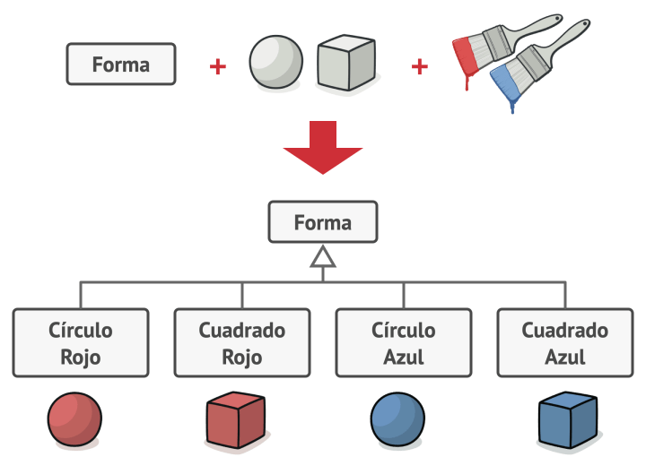
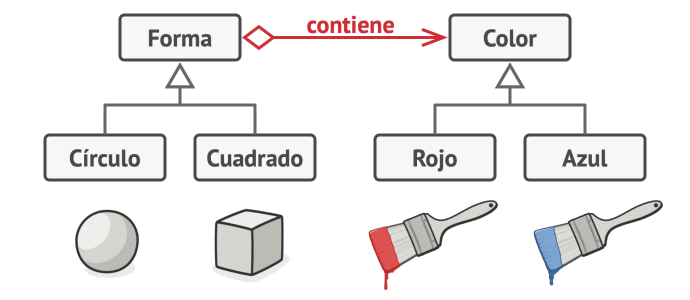

# Patrón de Diseño Bridge

### Yordi Robles Siles - C06557

## Definición del patrón

Bridge es un patrón de diseño de tipo **estructural** que te permite dividir una clase grande, o un grupo de clases estrechamente relacionadas, en dos jerarquías separadas (abstracción e implementación) que pueden desarrollarse independientemente la una de la otra.

## ¿Cuál es el problema común que resuelve?

### Problema

El problema que aborda el patrón Bridge aparece cuando una clase tiene dos o más dimensiones de variación , y estas dimensiones tienden a crecer o cambiar de manera independiente.

Si se intenta representar todas las combinaciones posibles mediante herencia, la jerarquía de clases se vuelve rígida, difícil de mantener y propensa a un crecimiento exponencial.

El número de combinaciones de clase crece en progresión geométrica.

### Solución

El patrón Bridge intenta resolver este problema pasando de la herencia a la composición del objeto. Esto quiere decir que se extrae una de las dimensiones a una jerarquía de clases separada, de modo que las clases originales referencian un objeto de la nueva jerarquía, en lugar de tener todo su estado y sus funcionalidades dentro de una clase.

Se puede evitar la explosión de una jerarquía de clase transformándola en varias jerarquías relacionadas.

##  Abstracción e implementación
La Abstracción (también llamada interfaz) es una capa de control de alto nivel para una entidad. Esta capa no tiene que hacer ningún trabajo real por su cuenta, sino que debe delegar el trabajo a la capa de implementación (también llamada plataforma).

Cuando se trata de aplicación reales, la abstracción puede representarse por una interfaz gráfica de usuario (GUI), y la implementación puede ser el código del sistema operativo subyacente (API) a la que la capa GUI llama en respuesta a las interacciones del usuario.

##  Aplicabilidad
1.  Enlace en tiempo de ejecución: Generalmente, el método Bridge se utiliza para proporcionar el enlace en tiempo de ejecución de la implementación. En este caso, el enlace en tiempo de ejecución se refiere a lo que podemos llamar un método en tiempo de ejecución, en lugar de en tiempo de compilación.

2. Mapeo de clases: El método Bridge se utiliza para mapear las jerarquías de clases ortogonales.

3. Entorno de interfaz de usuario: Una aplicación práctica del método Bridge se utiliza en la definición de formas en un entorno de interfaz de usuario.

## Ventajas y desventajas

### Ventajas
- Principio de Responsabilidad Única: El patrón sigue claramente el principio de responsabilidad única, ya que desacopla una abstracción de su implementación para que ambas puedan variar de forma independiente.

- Principio Abierto/Cerrado: No viola el principio Abierto/Cerrado, ya que en cualquier momento se puede introducir nuevas abstracciones e implementaciones de forma independiente.

- Característica independiente de la plataforma: El patrón se puede utilizar fácilmente para implementar características independientes de la plataforma.

### Desventajas
- Complejidad: El código podría volverse complejo después de aplicar el método Bridge debido a la intrusión en nuevas clases de abstracción e interfaces.

- Doble indirección: El método Bridge podría tener un ligero impacto negativo en el rendimiento, ya que la abstracción necesita pasar mensajes junto con la implementación para que la operación se ejecute.

- Interfaces con una sola implementación: Si se tiene un conjunto de interfaces descompuesto con una implementación mínima o una sola, la gestión se vuelve difícil.

## Referencias

- [Refacturing Guru - Patrón bridge](https://refactoring.guru/es/design-patterns/bridge)

- [Geek for geeks - Bridge Method](https://www.geeksforgeeks.org/python/bridge-method-python-design-patterns/)