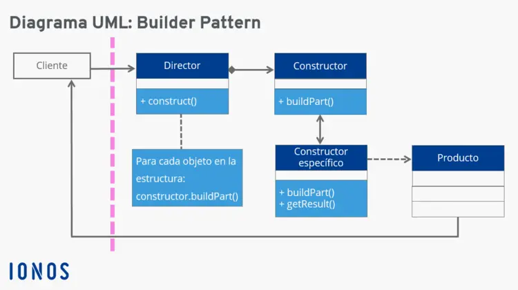

# Builder Design Pattern

Estudiante: Eduardo Sancho Selva | C17343

## ¿Qué es?

**Builder** es un patrón de diseño que facilita y ordena la construcción de objetos complejos. Es un patrón de diseño *creacional*, lo que significa que apoya en la creación de objetos. El **Builder** permite, mediante un constructor base y constructores concretos, producir representaciones distintas de un objeto con el mismo código de construcción base.

## Problema

El problema principal que busca resolver el patrón Builder es el de construir objetos complejos que pueden tener muchas representaciones muy variadas, especialmente aquellos que tienen muchos atributos opcionales o pasos de construcción complejos.

### Ejemplo

Piénsese en un objeto **Casa**. Las casas tienen atributos globales, es decir, que todas las casas comparten, como lo pueden ser las puertas, ventanas, paredes y techo. Sin embargo, las casas varían mucho entre sí: algunas pueden tener más elementos (jardín, garaje, piscina), o pueden variar en material (madera, piedra). Todas estas especificaciones complican la creación del objeto, ya que incluyen atributos que no siempre se van a utilizar (como un jardín) e implementaciones distintas del proceso de construcción (construir paredes de madera o de piedra).

### Soluciones sin builder

***1. Jerarquía de clases***

Una posible solución es la creación de muchas clases pequeñas que hereden de una clase base. Siguiendo el ejemplo, se puede tener como base la clase **Casa** y las implementaciones concretas **CasaDeMadera**, **CasaDePiedra**, **CasaConPiscina**, etc. Así, la clase base contiene los atributos que comparten todas las casas y cada implementación tiene sus atributos específicos. El problema de esta solución es que crea una jerarquía de clases muy extensa, donde cada implementación específica requiere crear una nueva clase y la adición de un parámetro nuevo, como tipos de puertas, implica extenderla aún más.

***2. Clase única con formas diferentes***

La otra solución a este problema que no involucra el patrón builder consiste en mantener una única clase (**Casa**) que implemente todas las posibles representaciones. Esto deja a una clase con muchos atributos opcionales, lo que complica la construcción al tener un método constructor con muchos parámetros que, en la mayoría de las veces, no se utilizarán.

Adicionalmente, esta solución puede llevar a implementar un constructor telescópico, que consiste en sobrecargar el constructor con parámetros diferentes y refiriendo al constructor base. Esta implementación complica la lectura del código y mantiene el problema de parámetros sin usar.

## Solución

El patrón **Builder** resuelve este problema mediante la separación del producto y su construcción en clases distintas. Su funcionamiento consiste en delegar la creación de los objetos a clases constructoras específicas, que dividen el trabajo de construcción en métodos que realizan un paso a la vez.

### Componentes

1. Producto

Es el objeto que se está creando con el patrón. Son objetos complejos, que pueden tener muchos atributos diferentes que no siempre serán usados y pasos de construcción complejos. Esta clase incluye todos los atributos que se podría tener el objeto, aunque no se usen en ciertos casos. Siguiendo el ejemplo presentado anteriormente, sería la clase **Casa**.

2. Builder base

Es la clase constructora del objeto de la que heredarán los builders concretos. Esta clase contiene métodos para cada uno de los pasos de construcción y un método que retorne el objeto final. Su objetivo es servir de base para los constructores concretos, que sí entran en detalles sobre implementaciones. Podría verse como una clase **CasaBuilder**, con métodos como *construirParedes()*, *construirTecho*, etc. Un detalle importante es que esta clase debe incluir todos los pasos posibles; por ejemplo, **CasaBuilder** debe incluir un método *construirGaraje()* aunque no todas las implementaciones lo vayan a utilizar.

3. Builders concretos

Son constructores específicos para las diferentes representaciones del producto que se está creando. Cada constructor concreto es una clase aparte que hereda del Builder base e implementa por su cuenta los pasos de construcción según sus detalles específicos. Por ejemplo, un **CasaDeMaderaBuilder** implementaría el método *construirParedes()* de forma distinta a **CasaDePiedraBuilder**. 

4. Director (opcional)

El cuarto componente es otra clase opcional referida como el director. Esta clase actúa como una interfaz entre el cliente y los constructores, facilitando el proceso desde el lado del cliente. El director tiene métodos para construir objetos en su totalidad; métodos distintos indican representaciones del producto que siguen pasos diferentes o en orden distinto. Esta clase recibe una instancia de un constructor concreto y utiliza sus métodos para construir el producto. Por ejemplo, un director podría crear una casa de madera o una casa de piedra con el mismo método, ya que ambas siguen los mismos pasos y su implementación depende del tipo de Builder que recibe. Sin embargo, para una casa con garaje, sí se requiere un método distinto que llame también al paso de construir el garaje.

### Diagrama UML

En el siguiente diagrama se puede ver la estructura usual del patrón **Builder**, incluyendo la clase director. Se puede ver que el cliente hace el pedido a la clase director, la cual manda a crear el producto usando los constructores.

### Ventajas

- El uso de este patrón tiene la principal ventaja de que permite crear objetos complejos, con atributos opcionales y pasos de construcción complejos, de manera ordenada y siguiendo buenas prácticas de programación.

- Otra ventaja es la claridad y legibilidad al implementar este patrón. Al tener constructores concretos para las diferentes representaciones del producto, se puede ver fácilmente cuáles son los pasos necesarios para crearlos.

- Además, este patrón ayuda a seguir los principios **SOLID**, especialmente:
  - *Single Responsibility Principle*, ya que todos los constructores concretos tienen la tarea clara de construir una representación específica del producto
  - *Open/Closed Principle*, porque esta separación de implementaciones facilita la creación de nuevas representaciones del objeto sin modificar las ya existentes.
  - Dependency Inversion Principle, ya que se tiene una jerarquía de dependencias clara en la que la cabeza es el constructor base abstracto, dejando detalles de implementación a los constructores concretos.

### Desventajas

- Muchas clases -> complejidad de código
Una desventaja que tiene el patrón **Builder** es la acumulación de muchas clases al tener muchas representaciones de un objeto, ya que cada una de ellas ocupa una clase Builder.

- También puede causar duplicación de código, en casos donde diferentes representaciones del producto tienen implementaciones de los pasos iguales. Esto podría atenuarse implementando jerarquías de herencia entre constructores.

- Por último, aunque este patrón es extremadamente útil para objetos complejos, se vuelve muy complicado y extenso cuando se intenta usar en objetos simples. Por esto, es recomendable discernir cuándo el patrón es útil y cuándo puede ser una carga adicional al programar.
