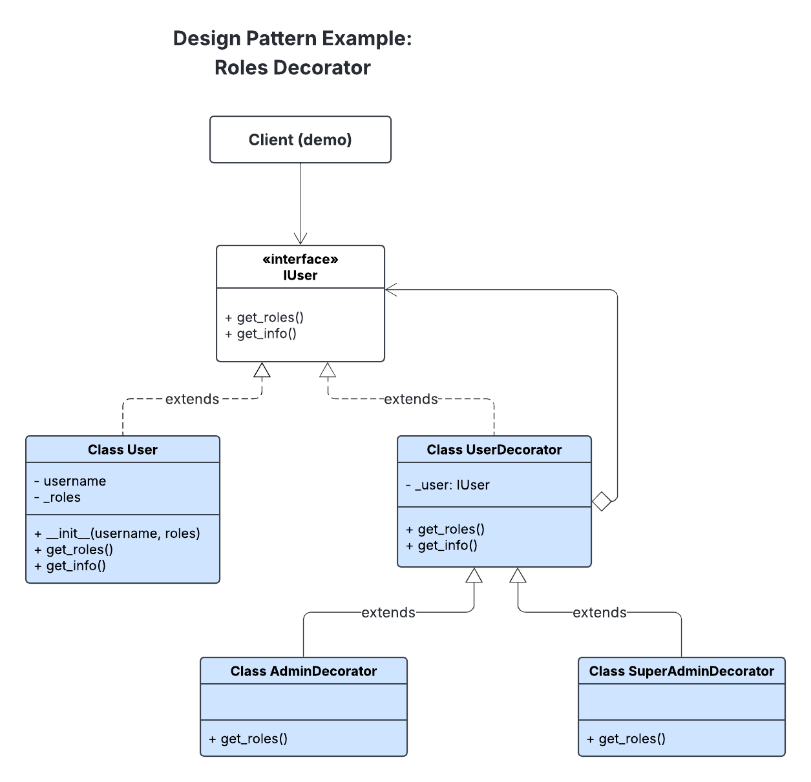

# Ejemplo Patrón Decorator: Sistema de Usuarios con Roles y Permisos

## Sistema de Permisos (user_permissions.py)

La implementación incluye un sistema de permisos basado en niveles que determina las acciones permitidas según los roles del usuario:

### Estructura de Niveles
```python
ROLE_LEVEL = {
    "user": 1,
    "admin": 2,
    "superadmin": 3
}

PERMISSION_LEVEL = {
    "view": 1,
    "edit": 2,
    "delete": 3
}
```

Establece un sistema de jerarquía donde cada rol y permiso tiene un nivel numérico asociado. Esto permite comparaciones cuantitativas para determinar el acceso.

---
### Comportamiento según el Rol

**Usuario Básico**:
- Roles: `["user"]`
- Nivel máximo: 1
- Permisos: acciones que requieren nivel 1 ("view")
- Sin permisos: acciones que requieren nivel 2 o superior ("edit", "delete")

**Usuario Administrador**:
- Roles: `["user", "admin"]`
- Nivel máximo: 2
- Permisos: acciones que requieren nivel 1-2 ("view", "edit")
- Sin permisos: acciones que requieren nivel 3 ("delete")

**Usuario SuperAdministrador**:
- Roles: `["user", "admin", "superadmin"]`
- Nivel máximo: 3
- Permisos: todas las acciones ("view", "edit", "delete")


## Implementación de Decoradores (user_decorators.py)

El siguiente diagrama muestra la implementación concreta del patrón Decorator en un sistema de gestión de usuarios con roles dinámicos (`user`, `admin`, `superadmin`).

### Diagrama de Ejemplo



### 1. IUser (Interfaz Componente)

```python
class IUser(ABC):
    @abstractmethod
    def get_roles(self):
        """Retorna la lista de roles asignados al usuario"""
        pass

    @abstractmethod
    def get_info(self):
        """Retorna la información del usuario"""
        pass
```

- Define la interfaz que todos los usuarios y decoradores deben implementar.
- Obliga a que cualquier clase que implemente `IUser` tenga los métodos `get_roles()` y `get_info()`.
- Permite que tanto los objetos concretos como los decoradores puedan ser tratados de manera uniforme por el cliente.

---

### 2. User (Componente Concreto)

```python
class User(IUser):
    def __init__(self, username, roles=None):
        self.username = username
        self._roles = roles or ["user"]

    def get_roles(self):
        return self._roles

    def get_info(self):
        return {"username": self.username, "roles": self.get_roles()}
```

- Representa el usuario base que puede ser decorado con roles adicionales.
- Almacena información básica del usuario y su lista de roles.
- Actúa como el componente central que se puede extender dinámicamente usando decoradores.

---

### 3. UserDecorator (Decorador Base)

```python
class UserDecorator(IUser):
    def __init__(self, user: IUser):
        self._user = user

    def get_roles(self):
        return self._user.get_roles()

    def get_info(self):
        info = self._user.get_info()
        info["roles"] = self.get_roles()
        return info
```

- Clase base para todos los decoradores de usuario.
- Contiene una referencia a un `IUser` y delega todas las llamadas a los métodos del objeto envuelto.
- Permite envolver un `User` o cualquier otro decorador y extender su comportamiento sin modificar la clase original.

---

### 4. AdminDecorator (Decorador Concreto)

```python
class AdminDecorator(UserDecorator):
    def get_roles(self):
        base = self._user.get_roles()
        if "admin" not in base:
            base = base + ["admin"]
        return base
```

- Añade el rol `admin` a un usuario existente.
- Sobrescribe el método `get_roles()` para incluir `admin` si aún no está presente.
- Permite asignar dinámicamente un rol de administrador sin cambiar el objeto base `User`.

---

### 5. SuperAdminDecorator (Decorador Concreto)

```python
class SuperAdminDecorator(UserDecorator):
    def get_roles(self):
        base = self._user.get_roles()
        if "superadmin" not in base:
            base = base + ["superadmin"]
        return base
```

- Añade el rol `superadmin` a un usuario existente.
- Sobrescribe el método `get_roles()` para incluir `superadmin` si aún no está presente.
- Permite asignar dinámicamente un rol de superadministrador sin cambiar el objeto base `User`.


## Flujo de Ejecución 

1. **Obtención de roles**: El sistema recupera los roles asociados al usuario.
2. **Determinación de nivel**: Calcula el nivel máximo entre los roles del usuario.
3. **Consulta de requisitos**: Identifica el nivel necesario para la acción solicitada.
4. **Decisión de acceso**: Compara niveles para determinar si se concede el permiso.

### Ejecutar demo.py
```bash
python lab3/decorator-pattern/src/demo.py
```