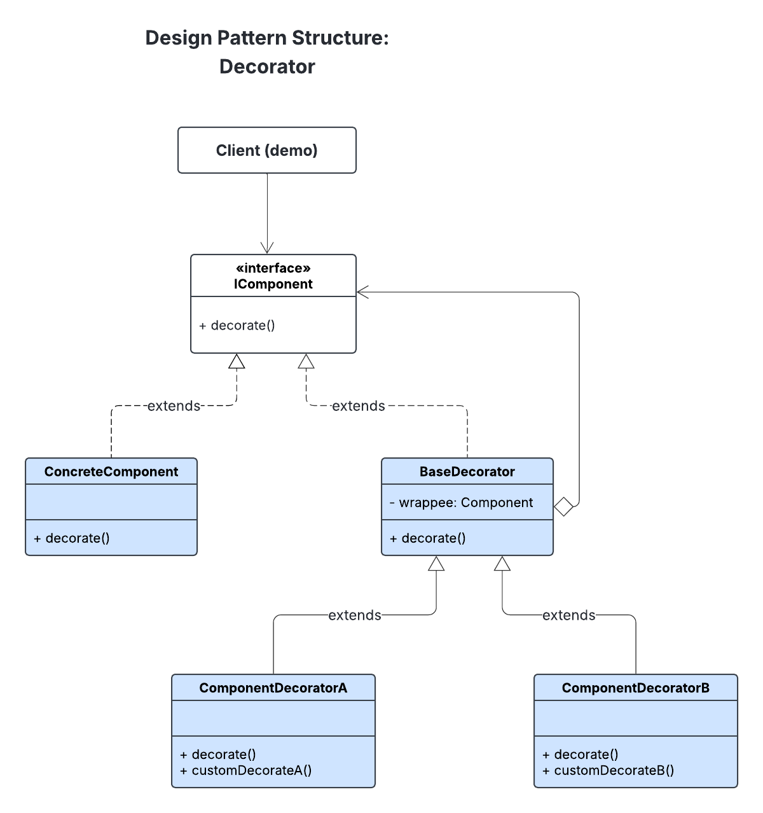

# Patrón de Diseño Decorator

## Tabla de Contenidos
1. [Definición](#definición)
2. [Problema y Solución](#problema-y-solución)
3. [Objetivos](#objetivos)
4. [Mecanismo de Funcionamiento](#mecanismo-de-funcionamiento)
5. [Estructura General](#estructura-general)
6. [Ventajas y Desventajas](#ventajas-y-desventajas)
7. [Ejemplo Práctico](#ejemplo-práctico)
8. [Referencias](#referencias)

## Definición

El patrón Decorator es un patrón estructural que organiza objetos en capas de funcionalidad mediante decoradores/wrappers (envolturas) encadenadas, donde cada capa agrega comportamientos específicos mientras mantiene la misma interfaz que el componente original. Esta estructura permite construir objetos complejos combinando múltiples funcionalidades de manera modular y dinámica.

El componente base se envuelve sucesivamente con decoradores que amplían su comportamiento, creando una estructura donde cada decorador realiza acciones adicionales y luego utiliza la funcionalidad base del objeto que envuelve.

## Problema y Solución del Patrón Decorator

### Problema
La herencia tradicional resulta ineficiente cuando se necesita añadir funcionalidades a objetos existentes, ya que requiere crear múltiples subclases para cada combinación posible o modificar profundamente la jerarquía de clases existente, generando código rígido y difícil de mantener.

### Solución
El patrón Decorator resuelve esto permitiendo añadir nuevas responsabilidades a objetos de forma dinámica mediante clases decoradoras que implementan la misma interfaz, facilitando la combinación flexible de funcionalidades sin alterar la estructura original de las clases.

## Objetivos

1. **Extender funcionalidades** de objetos de forma dinámica y transparente sin utilizar herencia tradicional.
3. **Permitir la composición flexible** de comportamientos a través de múltiples decoradores.
4. **Añadir responsabilidades** a objetos individuales sin afectar a otros objetos de la misma clase.
5. **Mantener el principio Open/Closed** - abierto para extensión pero cerrado para modificación.
6. **Facilitar la reutilización modular** de funcionalidades en diferentes contextos.

## Mecanismo de Funcionamiento

El patrón Decorator utiliza **composición** y **agregación** junto con el concepto de **wrapper**:

- Cada decorador contiene una referencia al objeto que envuelve.
- Esto es **composición/agregación**, ya que el decorador delegará llamadas al objeto original mientras agrega su propio comportamiento.

- El decorador actúa como un **wrapper**: implementa la **misma interfaz** que el objeto envuelto y puede **modificar o extender el resultado**.

- La ventaja principal es que se pueden **encadenar múltiples wrappers**, combinando funcionalidades de manera dinámica y flexible sin modificar la clase base.

## Estructura General 

El patrón Decorador se compone de los siguientes elementos:

1. **Componente (IComponent / Interface):** Define la interfaz común para objetos envueltos y decoradores.
2. **Componente Concreto (ConcreteComponent):** Implementa el comportamiento base que los decoradores pueden extender.
3. **Decorador Base (BaseDecorator):** Clase abstracta que sigue la interfaz del componente. Contiene un campo que referencia al objeto envuelto y delega las operaciones.
4. **Decoradores Concretos (ConcreteDecorator):** Extienden la clase base y agregan funcionalidades adicionales, pueden formar cadenas de decoradores.
5. **Cliente:** Envuelve los componentes en varias capas de decoradores, trabajando siempre con la interfaz del componente.

El siguiente diagrama muestra la estructura general del patrón Decorator, mostrando la relación entre los diferentes componentes.

### Diagrama de Estructura

## Ventajas y Desventajas

### Ventajas

- **Flexibilidad:** permite agregar funciones sin modificar el código original ni usar herencia.
- **Ampliación de funciones sin herencia:** las funcionalidades pueden añadirse o quitarse en tiempo de ejecución.
- **Composición de funcionalidades:** combina múltiples decoradores para crear objetos complejos.
- **Responsabilidad única:** cada decorador tiene una función específica y bien definida.

### Desventajas

- **Mayor complejidad de software:** puede generar muchas clases pequeñas.
- **Difícil de entender al inicio:** especialmente con varias capas de decoradores.
- **Alto número de objetos:** requiere un buen control para evitar confusión con muchos objetos decoradores.
- **Depuración complicada:** las cadenas de llamadas pueden ser difíciles de rastrear.

## Ejemplo Práctico
La explicación del ejemplo práctico del patrón Decorator se encuentra en el [README de DecoratorExample](./DecoratorExample.md). Corresponde a un sistema de usuarios con roles y permisos, donde los roles se implementan como decoradores que añaden funcionalidades a un usuario base.

## Referencias:

[1] [IONOS - ¿Qué es el patrón de diseño Decorator?](https://www.ionos.com/es-us/digitalguide/paginas-web/desarrollo-web/que-es-el-patron-de-diseno-decorator/)

[2] [Refactoring Guru - Patrón Decorator](https://refactoring.guru/es/design-patterns/decorator)

[3] [Medium - Design Patterns in Python: Decorator](https://medium.com/@amirm.lavasani/design-patterns-in-python-decorator-c882c0db6501)

