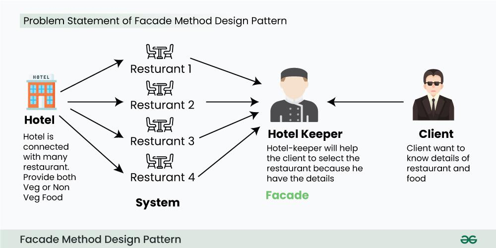

= Facade Pattern
:experimental:
:nofooter:
:source-highlighter: pygments
:sectnums:
:stem: latexmath
:toc: auto
:toclevels: 2
:xrefstyle: short

*Estudiante:* Amber Villarreal Campos - C28481

== Definición

El patrón *Facade (Fachada)* es un patrón de diseño estructural que proporciona una interfaz simplificada y unificada para un conjunto de interfaces en un subsistema. Este patrón oculta la complejidad del sistema y facilita su uso al ofrecer una única interfaz que interactúa con múltiples componentes internos, permitiendo a los clientes acceder a las funcionalidades del sistema sin necesidad de comprender su estructura interna y promoviendo un acoplamiento más débil entre los componentes del sistema, lo que mejora la mantenibilidad y escalabilidad del software. <<GeeksforGeeks2025,[1]>>

== Problema

Cuando se trabaja con sistemas complejos que involucran múltiples clases y componentes de un subsistema, surge la *complejidad de gestionar las interacciones entre estos componentes*. Los clientes que necesitan utilizar las funcionalidades del subsistema a menudo se ven obligados a lidiar con múltiples interfaces y dependencias, lo que puede llevar a un código *difícil de entender y mantener*. Esta complejidad puede resultar en errores, duplicación de código y dificultades para realizar cambios o actualizaciones en el sistema. <<RefactoringGuru, [2]>>

== Solución

Este patrón propone la creación de una clase *Fachada* que actúa como una interfaz simplificada para el subsistema. La clase Fachada encapsula las interacciones con los componentes internos del subsistema y proporciona métodos que los clientes pueden utilizar para acceder a las funcionalidades del sistema *sin necesidad de comprender su complejidad interna*. Al utilizar la Fachada, los clientes pueden interactuar con el subsistema de manera más sencilla y directa, lo que reduce la complejidad y mejora la mantenibilidad del código. <<RefactoringGuru, [2]>>

== Estructura

image:img/Facade-Diagram.svg[Facade Pattern Structure]

_Figura 1. Estructura general del patrón Facade - Elaboración propia_

El diagrama muestra la relación entre el Cliente, la Facade y los componentes del subsistema, donde la Facade actúa como intermediario que simplifica las interacciones complejas.

_Figura 2. Ejemplo práctico: Sistema de consulta de restaurantes en hotel <<GeeksforGeeks2025,[1]>>_

Este ejemplo ilustra cómo un `HotelKeeper` (Facade) simplifica el acceso a múltiples restaurantes (`VegRestaurant`, `NonVegRestaurant`, `VegNonBothRestaurant`) para el cliente.

== Usos comunes

* *Sistemas Complejos* – Cuando se trabaja con sistemas que tienen múltiples componentes y clases interrelacionadas.
* *Subsistema por capas* – Cuando se desea definir límites claros entre capas y ofrecer interfaces simplificadas para cada subsistema.
* *Integración de Sistemas* – Cuando se necesita combinar múltiples APIs o sistemas heredados en una interfaz unificada.

== Ventajas y Desventajas
.Ventajas
* *Simplificación de la Interfaz* – Proporciona una interfaz clara mientras oculta las complejidades del sistema.
* *Acoplamiento Reducido* – Minimiza la dependencia del cliente en los detalles internos del sistema y promueve la modularidad.
* *Encapsulamiento* – Protege a los clientes de los cambios en el subsistema al envolver interacciones complejas.
* *Mejora de la Mantenibilidad* – Permite cambios, refactorizaciones y extensiones del sistema más fácilmente sin afectar a los clientes

.Desventajas
* *Incremento de la Complejidad* – Añade otra capa de abstracción, haciendo que el código sea más difícil de entender y depurar.
* *Flexibilidad Reducida* – Limita el acceso directo a funcionalidades específicas del subsistema.
* *Sobreingeniería* – Puede añadir complejidad innecesaria en sistemas simples.
* *Potencial Sobrecarga de Rendimiento* – La indirección extra puede impactar el rendimiento en escenarios críticos.

[NOTE]
Basado en: <<GeeksforGeeks2025,[1]>>

== Relación con otros patrones

* *Mediator:* Ambos patrones buscan simplificar las interacciones entre componentes, pero el Mediator centraliza la comunicación entre objetos, mientras que el Facade proporciona una interfaz simplificada para un subsistema completo.
* *Singleton:* A menudo, una clase Facade se implementa como un Singleton para asegurar que solo exista una instancia de la fachada en todo el sistema.

== Testing

Este patrón de diseño facilita las pruebas unitarias al *proporcionar una interfaz simplificada para interactuar con sistemas complejos*. Al utilizar una fachada, los desarrolladores pueden aislar y probar componentes individuales del subsistema sin necesidad de configurar todo el sistema, lo que reduce la complejidad de las pruebas y mejora la eficiencia del proceso de testing. <<AppSignal2020, [3]>>

Algunas ventajas específicas incluyen:

* **Mocking simplificado** - Se puede reemplazar fácilmente todo el subsistema con un doble de prueba.
* **Reducción de dependencias** - Las pruebas pueden centrarse en la lógica de negocio sin preocuparse por las interacciones complejas del subsistema.
* **Pruebas más rápidas** - Evita la necesidad de inicializar todo el subsistema para la ejecución de pruebas.

== Ejemplo en Python

== Referencias
[[GeeksforGeeks2025]]
[1] GeeksforGeeks. (2025, 26 de septiembre). Facade Method design pattern. GeeksforGeeks. https://www.geeksforgeeks.org/system-design/facade-design-pattern-introduction/

[[RefactoringGuru]]
[2] Refactoring Guru. (s. f.). Facade. https://refactoring.guru/design-patterns/facade

[[AppSignal2020]]
[3] Pestilli, D. (2020, 18 de marzo). Facade Pattern in Rails for Performance and Maintainability. AppSignal. https://blog.appsignal.com/2020/03/18/facade-pattern-in-rails-for-performance-and-maintainability.html#testing-benefits