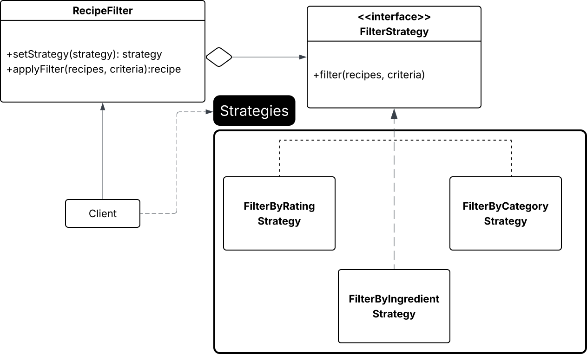

# Patrón de diseño Strategy

## Tabla de contenidos

- [1. Introducción](#1-introducción)
- [2. Definición](#2-definición)
- [3. Problema y solución](#3-problema-y-solución)
- [4. Estructura](#4-estructura)
  - [4.1 Diagrama](#41-diagrama)
  - [4.2 Componentes](#42-componentes)
    - [4.2.1 Contexto](#421-contexto)
    - [4.2.2 Estrategia](#422-estrategia)
    - [4.2.3 Estrategias](#423-estrategias)
    - [4.2.4 Cliente](#424-cliente)
- [5. Ventajas y desventajas](#5-ventajas-y-desventajas)
  - [5.1 Ventajas](#51-ventajas)
  - [5.2 Desventajas](#52-desventajas)
- [6. Aplicabilidad](#6-aplicabilidad)
- [7. Flujo](#7-flujo)
- [8. Testing](#8-testing)
- [9. Casos de uso](#9-casos-de-uso)
- [10. Ejemplo](#10-ejemplo)
  - [10.1 Ejemplo de Filtración por Rating](#101-ejemplo-con-filtración-por-rating)
  - [10.2 Ejemplo de Filtración por Ingrediente](#102-ejemplo-con-filtración-por-ingrediente)
  - [10.3 Modificaciones realizadas](#103-modificaciones-realizadas)
- [11. Referencias](#11-referencias)

## 1. Introducción

El patrón de diseño _Strategy_ busca separar las soluciones a un problema para que quien las vaya a usar pueda elegir cual se adecua mejor. Para entender esto se puede pensar con un ejemplo de la vida real. Digamos que hay una persona que debe de ir al aeropuerto a tomar un vuelo por lo cual decide no irse en su carro ya que nadie puede dejarlo. Esta persona tiene las opciones de irse en autobus, taxi o tren ya que todos lo dejarían igual de cerca. La persona puede elegir cualquiera de estas maneras según sus prioridades como el costo, el tiempo o la comodidad. De la misma manera que esta persona elige el método de transporte cuando va de camino este patrón permite intercambiar comportamiento durante el tiempo de ejecución.

## 2. Definición

"Strategy is a behavioural design pattern that lets you define a family of algorithms, put each of them into a separate class, and make their objects interchangeable" [[1]](#11-referencias)

## 3. Problema y solución

Al añadir un nuevo algoritmo para resolver una tarea específica, la clase principal duplica su tamaño. Esto hace que el código sea inflexible y difícil de mantener, ya que viola el principio de _Open/Closed_ al modificar la clase principal cada vez que se requiere un cambio, lo que la vuelve rígida, lo que puede afectar su capacidad de modificación o extensión.

El patrón _Strategy_ resuelve este problema extrayendo todas las soluciones del problema y separándolas en clases llamadas estrategias.

## 4. Estructura

### 4.1 Diagrama



### 4.2 Componentes

#### 4.2.1 Contexto

Funciona como intermediario entre el cliente y la estrategia pues es el encargado de asignar la tarea y contiene la referencia a la estratega permitiendo intercambiar las estrategias.

#### 4.2.2 Estrategia

La estrategia se refiere a la interfaz, la cual contiene la declaración de las estrategias.

#### 4.2.3 Estrategias

Las diferentes soluciones implementadas para el problema, basadas en la interfaz de la estrategia concreta.

#### 4.2.4 Cliente

A cargo de crear el objeto que va a ser enviado al contexto.

## 5. Ventajas y desventajas

### 5.1 Ventajas

1. _Desacoplamiento_: Permite el desacoplamiento ya que ninguna estrategia de solución sabe como funciona otra de estas.

2. _Flexibilidad_: Brinda gran flexibilidad a la hora de modificar estrategias ya que son independientes entre sí por lo cual los cambios pueden realizar directamente en su clase sin necesidad de manipular otras estrategias. A su vez, si se desea eliminar una de las estrategias solamente se debe eliminar su clase correspondiente y en caso de ser necesario pues estaba siendo usado se cambia la estrategia en la clase donde fue invocada.

3. _Fácil sustitución:_ Si se desea realizar algún cambio en la estrategia utilizada para resolver el problema este se realiza modificando únicamente donde indica cuál es el contexto a utilizar y el/los parámetros necesarios para llevar a cabo esa estrategia.

4. _Reutilización de código:_ Encapsula las estrategias entre las diferentes clases de strategy las cuales pueden ser usadas en otras partes del sistema.

5. _Mantenibilidad:_ Facilita la mantenabilidad del código por medio de la facibilidad de sustitución, el desacoplamiento y la flexibilidad.

6. _Separation of Concerns:_ Al dividir las estrategias en diferentes clases se cumple el principio de _Separation of Concerns_ ya que la implementa cada una de estas por aparte así existiendo una clara división de responsabilidades.

7. Se puede reemplazar la herencia con composición.

8. Permite intercambiar los algoritmos dentro de un objeto en tiempo de ejecución.

9. _Open/Closed Principle:_ Permite introducir nuevas estrategias sin necesidad de modificar el contexto.

### 5.2 Desventajas

1. En caso de ser un programa pequeño el cual no sufra de modificaciones constantes utilizar este patrón de diseño añadiría complicaciones innecesarias.

2. Hay lenguajes de programación que permiten implementar múltiples versiones de un algoritmo (como estrategias) dentro de un conjunto de funciones por lo cual añadir interfaces y clases para las estrategias, dependiendo del lenguaje, podría ser innecesario.

## 6. Aplicabilidad

1. Se utiliza cuando se desea separar la implementación, datos y dependencias del resto del código ya que los clientes solamente van a percibir una interfaz simple para ejecutar los algoritmos (estrategias).

2. Este patrón hace que el objeto original delegue la ejecución en lugar de implementar todas sus variaciones.

## 7. Flujo

1. Identificar cuál algoritmo es modificado constantemente o cuáles algoritmos tienen un comportamiento similar en el hecho de que son estrategias o maneras de solucionar un mismo problema pero depende del contexto cómo quiere solucionarse.

2. Declarar la interfaz común para las estrategias.

3. Separar estas estrategias en clases separadas.

4. En la clase de contexto, guardar una referencia al objeto.

5. Tener un setter para poder reemplazar los valores.

6. Los clientes del contexto asocian el problema con la mejor solución acorde al resultado esperado.

## 8. Testing

Para realizar testing sobre un sistema que utiliza el patrón de diseño Strategy debe de darse un enfoque multi-lateral, el cual se enfoque en cada uno de los componentes de su estructura así como las interacciones entre estos componentes. El siguiente es un ejemplo de cómo podría plantearse el testing de este patrón de diseño:

1. _Unit Testing estrategias concretas_

    - Se debe de probar de manera aislada la estrategia concreta con un algoritmo en específico.

    - Probar con diferentes entradas y datos inválidos para verificar la correctitud de la estrategia concreta.

    - Verificar que las salidas sean las esperadas con una estrategia en específico.

2. _Unit Testing el contexto_

    - Probar que delegue el contexto a la estrategia correcta.

    - Verificar que pueda cambiar de estrategia en tiempo de ejecución.

3. _Testing de la intregación_

    - Verificar el flujo correcto de los componentes de principio a fin.

    - Realizar pruebas donde el cliente elija una estrategia en específico y ver si se comporta de la manera esperada.

## 9. Casos de uso

Dentro de los diferentes casos de uso del patrón de diseño _Strategy_ se encuentran:

1. **Procesamiento de pagos:** como en las tiendas con sistemas en líneas que el pago se puede realizar por medio de diferentes tarjetas de débito, crédito, PayPal, entre otras opciones

2. **Algoritmos de ordenamiento:** si se quiere ordenar un cnjunto de datos, pueden utilizarse diferentes estrategias (como quicksort o mergsort)

3. **Sistemas de navegación:** un sistema de estos puede utilizar diferentes algoritmos para determinar la ruta dependiendo de la necesidad, ya sea por distancia, tiempo o condiciones

4. **Formateo de texto:** procesadores de texto que pueden formatear un texto con diferentes estrategias (negrita, italics, etc)

5. **Algoritmos de compresión:** dependiendo del tipo y tamaño de archivo pueden utilizar distintas estrategias para comprimirlo

## 10. Ejemplo

El ejemplo desarrollado para este patrón de diseño esta basado en el proyecto final del curso, principalmente en las funcionalidades del grupo de Recetas. Este ejemplo va dirigido a la funcionalidad de la filtración de recetas de diferentes maneras (por categoría, rating o ingrediente). La razón por la cual el uso de este patrón de diseño para esta funcionalidad es adecuado es debido a que este sigue la idea de que hay una tarea por cumplir la cual puede llevarse a cabo por medio de diferentes estrategias las cuales van a depender de cierto contexto. Las estrategias en este caso son según que aspecto van a ser filtradas las recetas que previamente fueron cargadas de un archivo csv. `FilterStrategy` viene a ser la interfaz en este ejemplo mientras que `FilterByStrategy`, `FilterByRating` y `FilterByIngredient` son las estrategias concretas, y por último `RecipeFilter` funciona como el contexto. `Recipe`es el modelo de los datos, `csvLoader` se encarga de cargar las recetas del csv de ejemplos de recetas y `demo` es el programa principal.

Una de las características de este patrón de diseño mencionada anteriormente es la facilidad para realizar un cambio de estrategia en el código, el cual puede realizarse modificando, en este caso, dos líneas. Para ejemplificar esto se muestra un pequeño snippet del código original y luego la versión modificada:

### 10.1 Ejemplo con Filtración por Rating

```Python
    filter.setStrategy(FilterByRating())
    resultado = filter.applyFilter(recipes, 10)
    for recipe in resultado:
        print(recipe)
    print()
```

### 10.2 Ejemplo con Filtración por Ingrediente

```Python
    filter.setStrategy(FilterByIngredient())
    resultado = filter.applyFilter(recipes, "huevo")
    for recipe in resultado:
        print(recipe)
    print()
```

### 10.3 Modificaciones realizadas

Las modificaciones a realizar para el cambio de estrategia serían cambiar el parámetro recibido por la función _setStrategy_ por la estrategia que se desea utilizar y el parámetro que recibe la función _applyFilter_ esto ya que dependiendo de la estrategia la información que se necesita para poder llevar a cabo dicha filtración. Con solo realizar esas dos modificaciones se pasa de una estrategia de filtración a otra.

```Python
    filter.setStrategy(FilterByIngredient())
    resultado = filter.applyFilter(recipes, "huevo")
```

## 11. Referencias

[1] Refactoring Guru, “Strategy,” Refactoring.guru, 2014. <https://refactoring.guru/design-patterns/strategy>

[2] GeeksforGeeks, “Strategy Design Pattern,” GeeksforGeeks, Apr. 29, 2016. <https://www.geeksforgeeks.org/system-design/strategy-pattern-set-1/>
