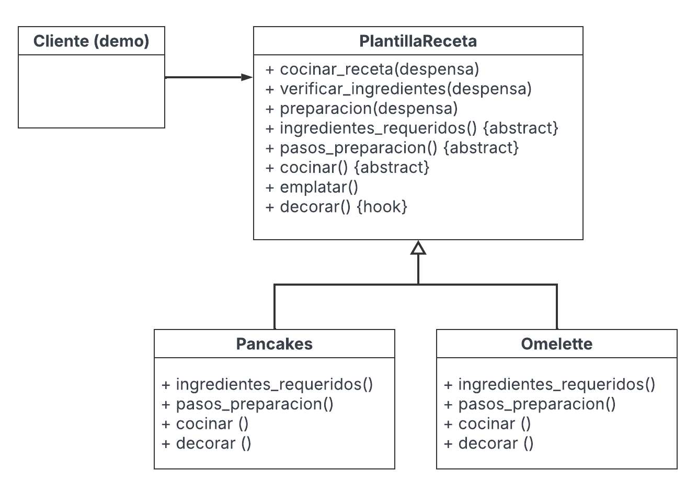

# Ejemplo de Template Method aplicado a recetas de cocina

La **clase base** define el **orden fijo** del algoritmo (verificación de ingredientes → preparación → cocción → emplatado → decoración) y cada receta concreta **solo** implementa los pasos que cambian.

## Estructura general del ejemplo

- `plantillaReceta.py`:  Clase base (Template Method) que contiene todos los pasos del algoritmo en orden
- `omelette.py`: Receta concreta (Subclase) de la receta de Omelettes
- `pancakes.py`: Receta concreta(Subclase) de la receta de Pancakes
- `despensa.py`: Utilidad para verificar ingredientes disponibles
- `demo.py`:  Cliente que ejecuta las recetas

## Diagrama de la estructura del código



## Explicación de la estructura del código

El patrón se refleja en el **rol** que juega cada archivo/clase:

### Clase Base

`PlantillaReceta` es la **clase Base** que implementa el **método plantilla**:

```python
def cocinar_receta(self, despensa):
    self.verificar_ingredientes(despensa)  # Paso fijo
    self.preparacion(despensa)  # Paso fijo que llama a pasos_preparacion()
    self.cocinar()  # Paso variable
    self.emplatar() # Paso fijo
    self.decorar()  # Hook opcional
```

- **Qué fija la base?**
  - El orden del algoritmo.
  - La verificación de ingredientes y el emplatado (pasos comunes).
  - La existencia de un hook (decorar) que por defecto puede no hacer nada o imprimir un mensaje.

- **Qué pasos variables declara la base?**
  - ingredientes_requeridos()
  - pasos_preparacion()
  - cocinar()
Estos métodos deben ser implementados por cada receta concreta y ajustados según las necesidades y requerimientos de cada receta.

### Subclases Concretas

`Pancakes` es una **Subclase concreta** que implementa los pasos variables:

```python
class Pancakes(PlantillaReceta):
    def ingredientes_requeridos(self):
        return ["harina", "azucar", "huevos", "leche", "polvo_de_hornear", "vainilla"]

    def pasos_preparacion(self):
        print(
            " - Mezclar harina, azúcar, sal y polvo de hornear\n"
            " - Aparte, batir huevos, leche y vainilla; integrar con la harina y mezclar hasta que quede sin grumos\n"
            " - Engrasar la sartén con un poco de aceite"
        )

    def cocinar(self):
        print(
            "Verter pequeñas porciones en el sartén a fuego medio; cuando salgan burbujas, voltear.\n"
            "Cocinar 1–2 min más hasta dorar."
        )

    def decorar(self):
        print("Servir con miel, fruta, crema batida o helado. ")
```

`Omelette` es otra **Subclase concreta**. Igual que los pancakes, implementa:

```python
class Omelette(PlantillaReceta):
    def ingredientes_requeridos(self):
        return ["huevos", "queso", "jamon"]

    def pasos_preparacion(self):
        print(
            " - Batir los huevos con una pizca de sal\n"
            " - Rallar/trozear el queso y cortar el jamón en cuadritos o tiritas\n"
            " - Precalentar sartén y engrasar con un poco de aceite"
        )

    def cocinar(self):
        print(
            "Verter los huevos batidos; cuando cuaje por bordes y el centro siga jugoso,\n"
            "repartir jamón y queso; doblar en media luna y cocinar 1–2 min más según el punto deseado."
        )

    def decorar(self):
        print("Echarle un poco de pimienta y un toque de perejil picado.")
```

### Función Auxiliar

`Despensa` es llamado por verificar_ingredientes(...) para asegurar que no le falte ningún ingrediente y que la receta se pueda empezar.

No conoce de recetas ni del orden: **no forma parte del patrón, es infraestructura.**

```python
class Despensa:
    @staticmethod
    def ingredientes_faltantes(requeridos, disponibles):
        """Devuelve lista de ingredientes faltantes"""
        return [i for i in requeridos if i not in disponibles]
```

### Cliente

`demo` actua como el **cliente que ejecuta el método plantilla** en las recetas concretas:

```python
if __name__ == "__main__":
    despensa = {
        "sal","pimienta","huevos","queso","tocino","harina","jamon","azucar","mantequilla","aceite","vainilla","polvo_de_hornear","leche"
    }

    print("\n==>", Pancakes.__name__)
    Pancakes().cocinar_receta(despensa)

    print("\n==>", Omelette.__name__)
    Omelette().cocinar_receta(despensa)
```

El cliente **no controla la secuencia interna**; solo elige qué receta correr y con qué ingredientes en la despensa.

## Como ejecutar

```python
python demo.py
```

## ¿Por qué esta organización?

La lógica común (validar ingredientes, orden del flujo, emplatado) está en PlantillaReceta.

Las variantes (pancakes, omelette, etc.) solo escriben lo que cambia, por lo que hay menos duplicación.

Agregar recetas es seguro y predecible ya que no se toca el flujo central, solo una subclase.

## Añadir una nueva receta

1. Crea un archivo nuevo, por ejemplo: ``crepas.py``

2. Hereda de ``PlantillaReceta`` e implementa los 3 pasos variables: ``ingredientes_requeridos()``, `pasos_preparacion()`, ``cocinar()``

3. Además se puede usar el hook ``decorar()`` y sobreescribir con la recomendación para la nueva receta.

4. En ``demo.py``, se importa y se llama a ``cocinar_receta(despensa)``.
