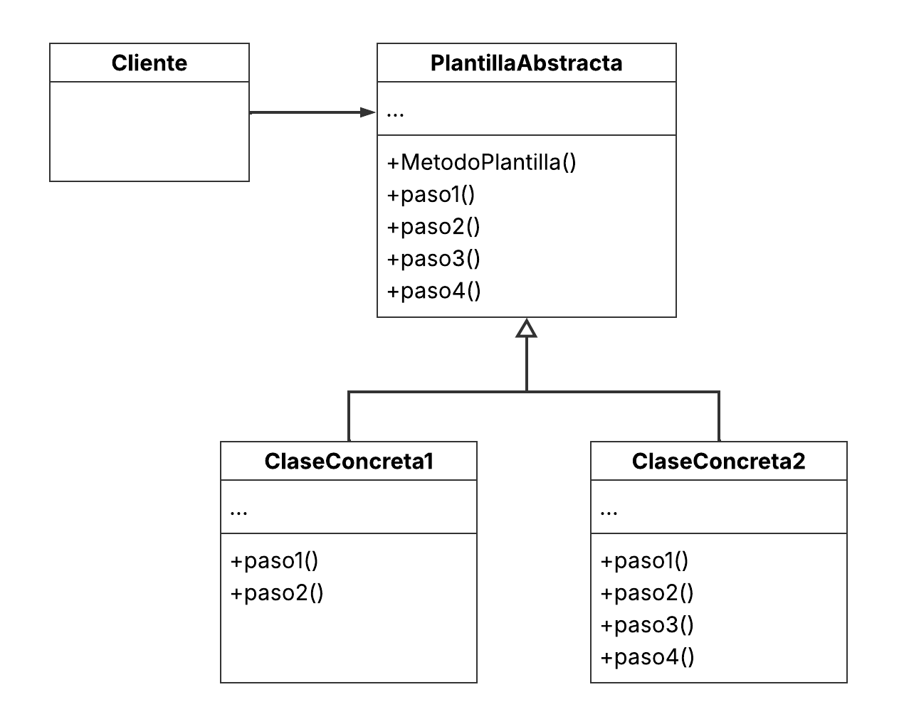
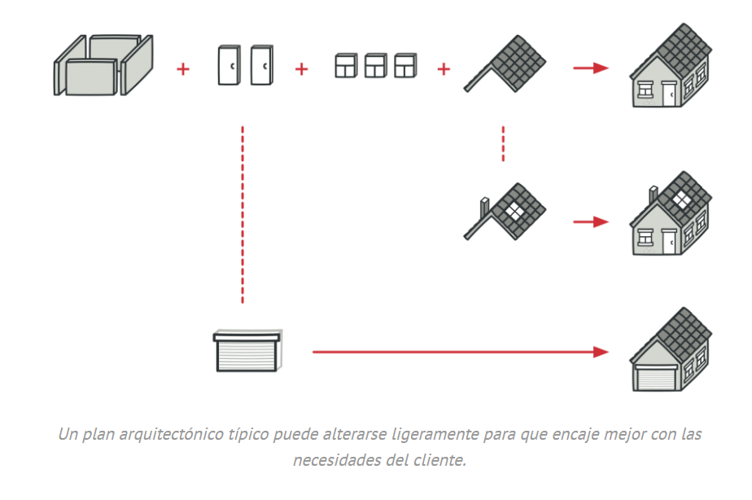
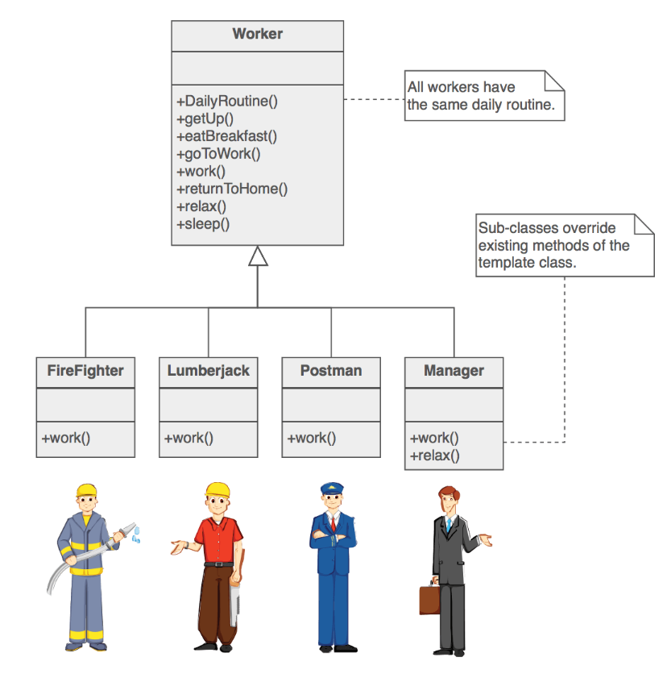

# Template Method

## Tabla de Contenidos

1. [Definición](#definición)  
2. [¿Cuál es el problema común que resuelve?](#cuál-es-el-problema-común-que-resuelve)  
3. [Estructura general](#estructura-general)  
4. [Mecanismo de Funcionamiento](#mecanismo-de-funcionamiento)  
5. [¿Cómo mejora el mantenimiento o escalabilidad del sistema?](#cómo-mejora-el-mantenimiento-o-escalabilidad-del-sistema)  
6. [Ejemplos del mundo real](#ejemplos-del-mundo-real)  
7. [Ventajas y desventajas de su uso](#ventajas-y-desventajas-de-su-uso)  
8. [¿Cuándo conviene usarlo y cuándo no?](#cuándo-conviene-usarlo-y-cuándo-no)  
9. [Cuándo no usarlo](#cuándo-no-usarlo)  
10. [Relaciones con otros patrones](#relaciones-con-otros-patrones)  
11. [Referencias](#referencias)

## Definición

Template Method es un patrón de diseño de **comportamiento (behavioural)** que define el esqueleto de un algoritmo en la superclase pero permite que las subclases sobrescriban pasos del algoritmo sin cambiar su estructura.

## ¿Cuál es el problema común que resuelve?

### Problema

Dos componentes distintos comparten gran parte de su lógica, pero no reutilizan interfaz ni implementación común. Cualquier cambio implica duplicar esfuerzos al modificar ambos componentes.

¿No sería mejor eliminar duplicación, manteniendo intacta la estructura del algoritmo?

### Solución

Template Method divide el algoritmo en una serie de pasos, convierte estos pasos en métodos y agrupa las llamadas a esos pasos en un único método plantilla que los invoca en un orden específico.

Algunos pasos son fijos y se implementan en todas las subclases y otros son variables y se pueden ajustar por cada subclase sin tocar la estructura ni el orden.

## Estructura general

El patrón Template Method se compone de los siguientes elementos:

1. **Clase Base Abstracta:**
Define el método plantilla (template method) que contiene la secuencia fija del algoritmo. Dentro de este método llama a pasos que pueden ser fijos, abstractos o hooks.

2. **Subclases Concretas:**
Implementan los pasos variantes y, si lo necesitan, los hooks, manteniendo el orden impuesto por el template method.

3. **Pasos Fijos:**
Lógica común que vive en la clase base y no cambia entre subclases.

4. **Pasos variables:**
Métodos que la clase base declara y que las subclases deben sobrescribir para personalizar partes concretas del algoritmo.

5. **Hooks (opcionales):**
Métodos con implementación por defecto, a menudo vacía, que las subclases pueden sobrescribir para agregar comportamiento adicional sin alterar la estructura.

6. **Cliente:**
Invoca el método plantilla sobre la clase concreta elegida. El cliente no controla la secuencia; solo pasa datos/contexto y recibe el resultado.

### Diagrama de la estructura de TemplateMethod

## Mecanismo de Funcionamiento

En Template Method la clase base decide el orden del proceso y las subclases solo cambian algunos pasos.

La base tiene el método plantilla que ejecuta todo en secuencia.

Algunos pasos están fijos; otros quedan para que las subclases los rellenen.

También puede haber hooks (pasos opcionales) que las subclases activan si quieren.

Así la secuencia no se toca, y los detalles se personalizan sin duplicar código.

## ¿Cómo mejora el mantenimiento o escalabilidad del sistema?

Template Method convierte un algoritmo monolítico en pasos individuales fácilmente extensibles, donde añadir o ajustar una etapa no obliga a reescribir todo el algoritmo.

Con este patrón de diseño, el mantenimiento puede hacerse más sencillo ya que un cambio de orden en la secuencia se define una sola vez en la superclase y automáticamente todas las variantes lo heredan.

Además, al hacer explícitos los pasos obligatorios, el proceso queda protegido contra atajos o omisiones accidentales.

Y también, al permitir trabajo en paralelo, distintos equipos pueden crear o ajustar subclases sin tocar el flujo central, permitiendo que el sistema crezca de forma ordenada y sin conflictos con el esqueleto común.

## Ejemplos del mundo real

Un ejemplo puede ser la construcción de viviendas en masa. Hay un plan base (cimientos → estructura → paredes → tuberías → cableado → acabados) que no cambia, y el dueño solo ajusta detalles (materiales, distribución menor, acabados). Así, la secuencia es fija, pero cada casa puede variar en los pasos permitidos.

O también, otro ejemplo puede ser la rutina diaria de distintos trabajadores:

## Ventajas y desventajas de su uso

### Ventajas

- **Secuencia única y centralizada:** el orden del flujo vive en una sola clase base.
- **Extensibilidad controlada (OCP):** añadir una variante nueva es crear una subclase, sin modificar lo existente.
- **Testing más simple:** pruebas del template para la secuencia y pruebas ligeras por variante; menos casos y mayor cobertura efectiva.
- **Cambio centralizado**: una actualización en la superclase beneficia a todas las variantes.  
- **Menos duplicación de código**: los pasos comunes no se repiten en cada variante. Lo común en la superclase y lo variable, en las subclases.
- **Trabajo en paralelo:** distintos equipos pueden implementar variantes sin modificar el flujo central.

### Desventajas

- Aumento de jerarquía de clases.  
- Subclases mal diseñadas pueden violar las expectativas del flujo.  
- Plantillas largas con muchos pasos son difíciles de mantener.  
- Limitación por el esqueleto proporcionado de un algoritmo.

## ¿Cuándo conviene usarlo y cuándo no?

### Cuándo sí usarlo

- Si tienes muchas clases con algoritmos casi idénticos y pequeñas diferencias.

- Si quieres permitir extensión solo en algunos pasos, manteniendo intacta la estructura.

- Si necesitas estandarizar pasos y reducir duplicación.

- Si buscas mantenimiento más fácil en el que un cambio en el orden afecte a todas las variantes desde la superclase.

### Cuándo no usarlo

- Si cada variante cambia todo el algoritmo, no solo pasos puntuales mejor usar Strategy o Policy.

- Si la jerarquía crece sin control, es decir, si se necesitan demasiadas subclases por diferencias pequeñas.

## Relaciones con otros patrones

- **Factory Method** es una especialización del Template Method; también puede ser un paso dentro de un Template Method mayor.

- **Template Method (herencia)** vs **Strategy (composición)**:
  - Template Method trabaja al nivel de la clase, por lo que es estático.
  - Strategy trabaja al nivel del objeto, permitiéndote cambiar los comportamientos durante el tiempo de ejecución.

## Referencias

[1] Refactoring.Guru — *Template Method*.  
    [https://refactoring.guru/es/design-patterns/template-method](https://refactoring.guru/es/design-patterns/template-method)

[2] SourceMaking — *Template Method Design Pattern*.  
    [https://sourcemaking.com/design_patterns/template_method](https://sourcemaking.com/design_patterns/template_method)

[3] Reactive Programming — *Patrones de Diseño: Template Method*.  
    [https://reactiveprogramming.io/blog/es/patrones-de-diseno/template-method](https://reactiveprogramming.io/blog/es/patrones-de-diseno/template-method)
