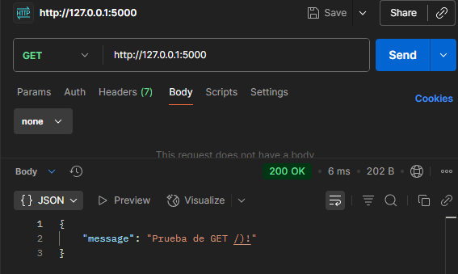
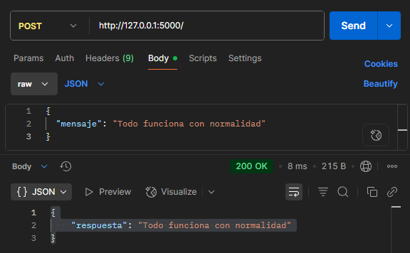
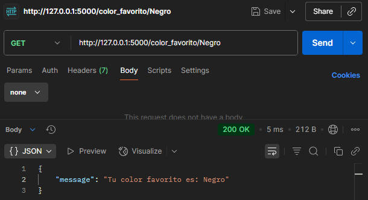

# James Araya Rodríguez

# Lab 2 – Mini App Flask (sin interfaz gráfica)

Este Laboratorio tiene como objetivo crear una **mini aplicación** utilizando **Flask (Python)**,  
que se comunique únicamente por **HTTP requests (GET y POST)**, sin interfaz gráfica.  

---

## REQUISITOS
- Python 3.13+
- Entorno virtual de Python (venv)
- Flask (instalado en el entorno virtual)

---

## PREPARACIÓN DEL ENTORNO

### 1. Clonar el repositorio del curso y cambiarse a la rama propia:
   ```bash
   git clone git@github.com:dsalazar-lectures/software-design-II-2025.git
   cd software-design-II-2025
   git checkout -b user/JamesLezcano/feature/lab2
````

### 2. Crear y activar el entorno virtual:

   ```bash
   py -m venv .venv
   .\.venv\Scripts\activate
   ```

### 3. Instalar dependencias:

   ```bash
   pip install -r labs\lab2_miniapp_Flask\requirements.txt
   ```

### 4. Ejecutar la aplicación:

   ```bash
   cd labs\lab2_miniapp_Flask
   py app.py
   ```

El servidor quedará corriendo en:
[http://127.0.0.1:5000](http://127.0.0.1:5000)

---

## CÓMO PROBAR

### Opción A: PowerShell

```powershell
# GET /
curl http://127.0.0.1:5000/

```
```powershell
# POST / (OK)
$body = @{ mensaje = "Se recivio el msj correctamente" } | ConvertTo-Json
Invoke-RestMethod -Uri "http://127.0.0.1:5000/" -Method POST -ContentType "application/json" -Body $body
```
```powershell
# GET /color_favorito/<color>
curl http://127.0.0.1:5000/color_favorito/Negro
```

### Opción B: Postman

```powershell
# GET / En la pestaña central seleccionar GET y pegal la siguiente dirección
http://127.0.0.1:5000/

# Precionar Send

```

```powershell
# POST /  En la pestaña central seleccionar POS y pegal la siguiente dirección
http://127.0.0.1:5000/

# Seguidamente seleccionar Body y elegir raw y pegar el siguiente JSON
{
  "mensaje": "Todo funciona con normalidad"
}
```


```powershell
# GET / 
http://127.0.0.1:5000/color_favorito/Negro
```



