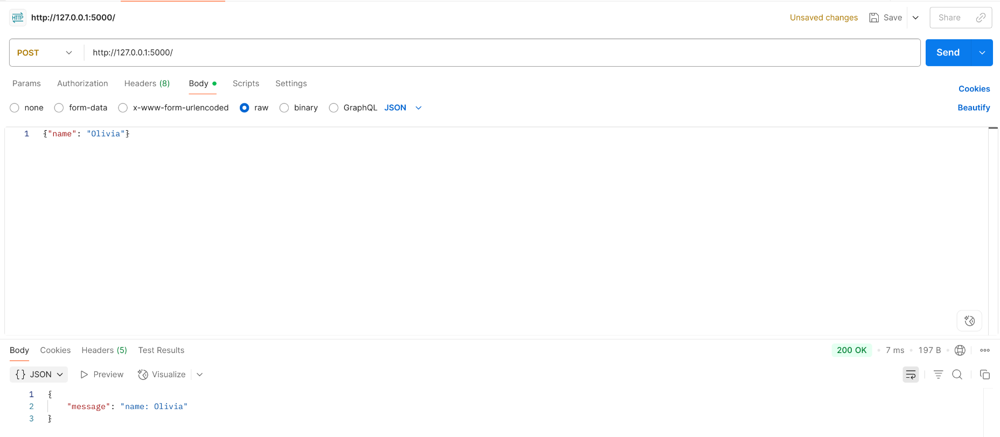
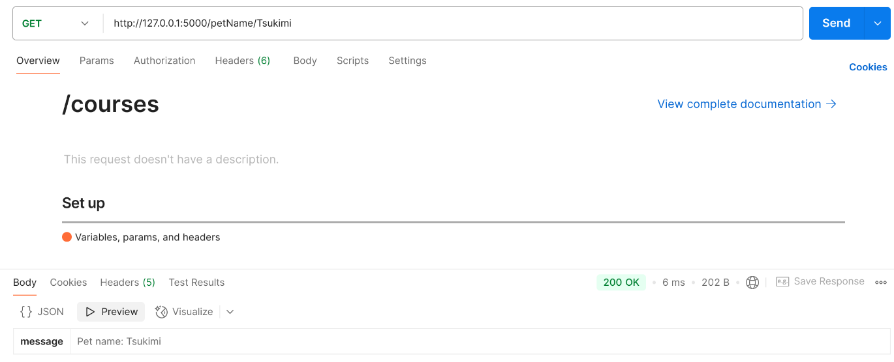

# Laboratorio02: Mini App

Este laboratorio consiste en desarrollar una versión pequeña de una aplicación similar a la utilizada en el proyecto del curso. Para su desarrollo se va a utilizar Python con Flask. Esta mini aplicación va a contener únicamente HTTP requests de GET y POST, sin interfaz gráfica. Para mostrar los resultados finales se va a hacer ppor medio de la herramienta de comunicación Postman.

## Resultados

### GET

Mensaje cualquiera para el GET

### POST

Mensaje que consuma una propiedad del request de un POST

### URL

Mensaje mostrando un valor que venga en la URL

